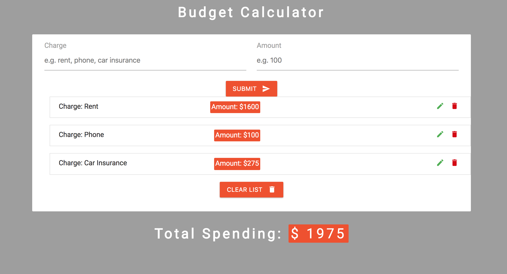

# Budget Calculator

In this project I'll be exercising my React Hooks in order to create a small CRUD application. It'll be a "budget calculator" that allows a user to add, update and delete charges + cost in a list. The focus is on learning how the two basic Hooks work: useState and useEffect.

Additional tools were React Icons (Materialize) and UUID.

Here's an image of the result (keep in mind the focus was on functionality, not looks):

